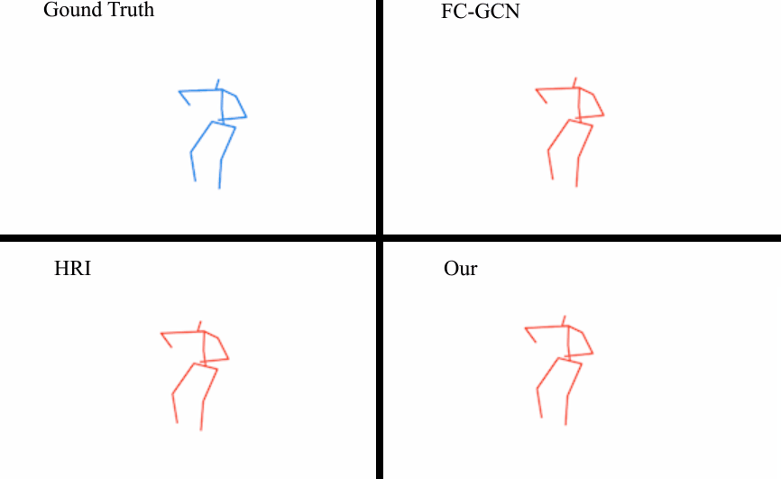
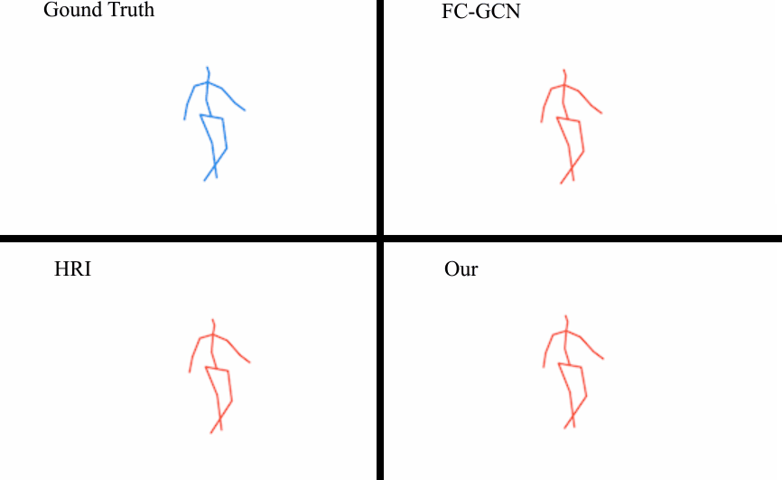
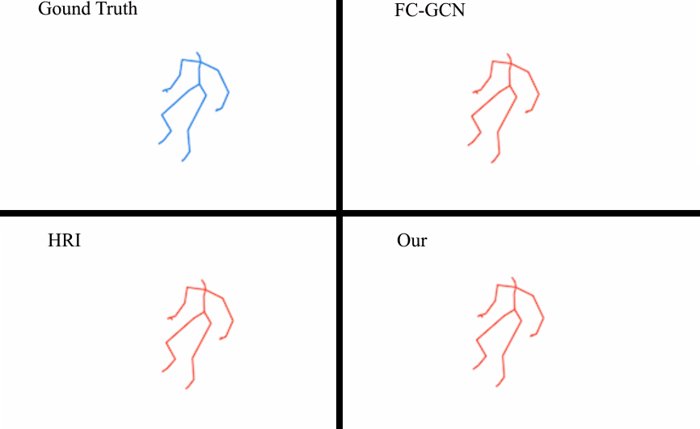
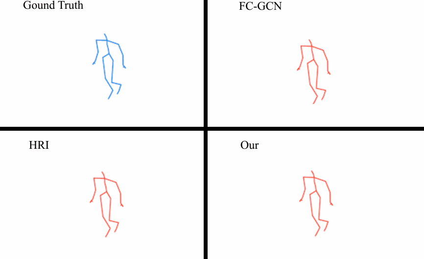

# Motion Prediction using Trajectory Cues

## Introduction
Predicting human motion from a historical pose sequence is at the core of many applications in computer vision. Current state-of-the-art methods concentrate on learning motion contexts in the pose space, however, the high dimensionality and complex nature of human pose invoke inherent difficulties in extracting such contexts. In this paper, we instead advocate to model motion contexts in the joint trajectory space, as the trajectory of a joint is smooth, vectorial, and gives sufficient information to the model. Moreover, most existing methods consider only the dependencies between skeletal connected joints, disregarding prior knowledge and the hidden connections between geometrically separated joints. Motivated by this, we propose a semi-constrained graph to explicitly encode skeletal connections and prior knowledge, while adaptively learn implicit dependencies between joints. 

We also explore the applications of our approach to a range of objects including human, fish, and mouse. Surprisingly, our method sets the new state-of-the-art performance on 4 different benchmark datasets, a remarkable highlight is that it achieves a 22.3% accuracy improvement over current state-of-the-art in average. To facilitate future research, we have released our code  (anonymized)  at https://github.com/ICCV-4228/MPT.

## Dataset

We used the 3D skeleton data from  Human3.6m , CMU-Mocap, Fish and Mouse datasets to train MPV:

Human 3.6m: http://vision.imar.ro/human3.6m/description.php

CMU-Mocap: https://github.com/chaneyddtt/Convolutional-Sequence-to-Sequence-Model-for-Human-Dynamics

Fish and Mouse: https://github.com/BII-wushuang/Lie-Group-Motion-Prediction


## Motion Prediction
The main file is found [ininertia_train_4GRU.py](code/ininertia_train_4GRU.py)

**Train**

To train and predict on default setting, execute the following with python 3.

```
python ininertia_train_4GRU.py
python close_prediction_4GRU.py
```

You can also change the model to train and predict for different action, simply set different  "keyword" in [preprocess.py](code/preprocess.py). 

 A list of actions in Human3.6m:

```
["Directions", "Discussion", "Eating", "Greeting", "Phoning",
 "Photo", "Posing", "Purchases", "Sitting", "SittingDown", 
 "Smoking", "Waiting", "Walking", "WalkDog", "WalkTogether"]
```

 The list of available actions in CMU Mocap dataset is:

```
["Basketball", "Basketball signal", "Directing traffic", "Jumping", 
 "Sitting Down", "Soccer", "Walking", "Wash window"]
```

**Visualize**

To visualize the predicted results, run:

```
python vis_modle.py
```

 visualization results  are saved in:
```
./data/
```

## **Prediction Visual Results**

### Eating



### Walking Dog



### Jumping



### Walking

